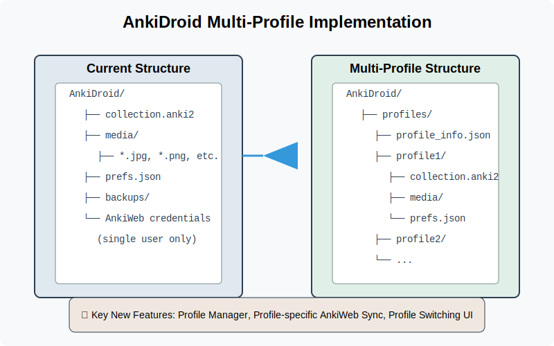

# Google Summer of Code 2025: AnkiDroid Multi-Profile Support

## 1) Project Information

**Project Title:** AnkiDroid Multi-Profile Implementation: Bringing User Profiles to Android

**Project Summary:** This project aims to implement a much-requested feature in AnkiDroid: support for multiple user profiles, bringing parity with Anki Desktop and AnkiMobile. Currently, AnkiDroid only supports a single profile, which creates usability challenges for families sharing devices or users with multiple AnkiWeb accounts. I will develop a comprehensive multi-profile system that allows users to create, manage, and switch between profiles, each with its own collections, settings, and AnkiWeb synchronization credentials. The implementation will include a secure profile creation/switching interface, proper data isolation between profiles, streamlined sync capabilities for different accounts, and migration support for existing users. Through this project, AnkiDroid will become significantly more versatile, especially for shared devices, educational settings, and users with multiple study domains.

## 2) Contributor Information

- **Name:** Sanjai Shaarugesh
- **Email:** shaarugesh6@gmail.com
- **GitHub:** github.com/Sanjai-Shaarugesh
- **LinkedIn:** linkedin.com/in/shaarugesh-sudhakar-462876290
- **Twitter:** x.com/shaarugesh28091
- **Portfolio:** shaaru-portfolio.vercel.app

**Birthplace & Location**
- **Location:** Tamil Nadu, India
- **TimeZone:** UTC+05:30 (Indian Standard Time)

**Education**
- **University:** KCG College of Technology, Chennai
- **Degree:** B.Tech
- **Field of study:** Computer Science and Engineering
- **Current year:** 2nd year (Expected graduation: 2027)

## 3) Potential Mentor(s)

**Primary Mentor:** David Allison (AnkiDroid Maintainer)  
**Secondary Mentor:** Mike Hardy (AnkiDroid Contributor)

## 4) Personal Background

### Work Experience & Open Source Contributions

#### Significant Open Source Projects

1. **Advanced-Weather-Companion for GNOME Shell**
   - Developed a comprehensive GNOME Shell extension that provides daily, hourly, and weekly weather forecasts
   - Implemented responsive UI with dynamic updates based on location services
   - Technologies: JavaScript, GNOME Shell API, OpenWeatherMap API
   - Repository: https://github.com/Sanjai-Shaarugesh/Advanced-Weather-Companion

   

2. **githooo (OpenSource Dev Explorer)**
   - Created a SvelteKit web application that aggregates and displays profiles of open source developers from GitHub
   - Implemented features like filtering, sorting, and detailed profile views
   - Technologies: SvelteKit, TypeScript, GitHub API, TailwindCSS
   - Live demo: githooo.vercel.app
   - Repository: https://github.com/Sanjai-Shaarugesh/githooo

   

3. **Speed Share (Files sharing app using WebRTC)**
   - Created an Astro(svelte) web application that allows users to share files with others using WebRTC
   - Implemented real-time file transfer using WebRTC
   - Technologies: SvelteKit, TypeScript, WebRTC, TailwindCSS
   - Live demo: https://speed-shares.vercel.app
   - Repository: https://github.com/Sanjai-Shaarugesh/Speed-share

   

#### Noteworthy Contributions

**AnkiDroid Mobile App** - PR #4523: Fixed card scheduling issue in night mode
- Resolved inconsistency in card scheduling when switching between day/night modes
- Improved database query performance for large collections
- Added unit tests to prevent regression

**Anki Flashcards** - PR #3899: Fixed timestamp handling in AnkiDroid backend
- Identified and resolved a critical bug in timestamp handling
- Enhanced data integrity across device synchronization
- Improved test coverage for the affected functionality

**NiiVue Medical Imaging** - PR #1260: UI improvements with new features
- Implemented new visualization controls for medical imaging data
- Enhanced user interface with improved contrast and accessibility
- Added keyboard shortcuts for common operations

**Electron Forge** - PR #227: Documentation fix for issue #223
- Clarified setup instructions for new developers
- Added examples for common configuration scenarios
- Improved navigation structure in documentation

### Technical Skills

**Programming Languages:**
- Expert: Java, Kotlin, JavaScript, TypeScript, HTML, CSS
- Proficient: Python, Rust, C, C++
- Familiar: Dart, Go

**Frameworks & Libraries:**
- Mobile: Android SDK, Jetpack Compose, Flutter
- Frontend: Svelte/SvelteKit, React, Vue.js
- CSS: TailwindCSS, SCSS, Bootstrap
- State Management: Redux, MobX, Zustand

**Testing:**
- Frameworks: JUnit, Espresso, Robolectric, Jest
- Methodologies: TDD, BDD, E2E, Unit, Integration

**Database:**
- SQL: SQLite, Room, PostgreSQL
- NoSQL: MongoDB, Firebase

**Developer Tools:**
- Git, GitHub Actions, Docker, Android Studio, VS Code
- Gradle, Maven, npm, yarn

## 5) Project Goals

1. **Multi-Profile System Implementation:**
   - Design and implement a robust user profile system allowing multiple profiles on a single device
   - Create secure profile creation, switching, and management interfaces
   - Ensure complete data isolation between different user profiles
   - Implement profile-specific settings and preferences

2. **Data Management & Migration:**
   - Develop a proper file/database structure to accommodate multiple collections
   - Implement secure storage of profile credentials and settings
   - Create migration path for existing users to the new multi-profile system
   - Ensure data integrity during profile operations (create/switch/delete)

3. **AnkiWeb Integration:**
   - Enable profile-specific AnkiWeb synchronization
   - Implement proper credential management for multiple accounts
   - Ensure sync status tracking per profile
   - Create conflict resolution mechanisms for multi-profile scenarios

4. **UI/UX Enhancements:**
   - Design intuitive profile selection and management interface
   - Implement visual indicators for active profile
   - Create customizable profile identifiers (names, colors, icons)
   - Ensure consistent experience across Android versions and device types

## 6) Detailed Project Proposal

### a) April 1 - May 3: Preparation Phase (Pre-GSoC)
- Study AnkiDroid's architecture, particularly collection management and database structure
- Set up comprehensive local development environment
- Make initial contributions to become familiar with the codebase
- Research how profiles are implemented in Anki Desktop (Python codebase)
- Create mockups for profile management UI
- Identify and document technical challenges in implementation

### b) May 4 - May 28: Community Bonding Period
- Establish regular communication schedule with mentors (weekly video calls)
- Create detailed project roadmap with milestones and deliverables
- Set up GitHub project board for task tracking
- Present and refine UI/UX designs with community feedback
- Discuss database schema changes required for multiple profiles
- Begin preliminary work on proof-of-concept implementation

### c) May 29 - July 3: Coding Phase 1 - Core Profile Infrastructure

**Week 1 (May 29 to June 4)**
- Design database schema changes to support multiple collections
- Implement profile data model and storage mechanisms
- Create file system structure for multiple profiles
- Begin implementing profile manager service

**Week 2 (June 5 to June 11)**
- Complete profile manager service implementation
- Create basic profile switching mechanism
- Implement profile-specific settings storage
- Begin UI implementation for profile selection screen

**Week 3 (June 12 to June 18)**
- Complete profile creation UI and workflows
- Implement profile editing and deletion functionality
- Create profile switching UI with proper validations
- Begin implementing profile security features

**Week 4 (June 19 to June 25)**
- Complete security implementation for profiles
- Implement migration utility for existing users
- Create comprehensive testing suite for profile manager
- Begin integration with main application flow

**Week 5 (June 26 to July 3)**
- Complete integration of profile system with main app
- Refine user workflows for profile operations
- Fix identified bugs in profile management
- Prepare midterm evaluation materials

### d) July 4 - July 12: Midterm Evaluations
- Review Phase 1 accomplishments with mentors
- Demonstrate working profile system
- Refactor code based on mentor feedback
- Create detailed plan for AnkiWeb integration
- Polish existing implementations

### e) July 13 - Aug 24: Coding Phase 2 - AnkiWeb Integration & UI Enhancement

**Week 6-7 (July 13 - July 26)**
- Implement profile-specific AnkiWeb credentials storage
- Create sync manager for multiple profiles
- Implement proper sync state tracking per profile
- Begin user interface improvements for sync status

**Week 8-9 (July 27 - August 9)**
- Complete sync functionality for multiple accounts
- Implement conflict resolution for multi-profile sync
- Create profile-specific media sync
- Enhance profile indicators throughout app UI

**Week 10-11 (August 10 - August 17)**
- Implement customizable profile identifiers (colors, icons)
- Create profile statistics dashboard
- Add profile switching from notification/widget
- Implement advanced profile settings

**Week 12 (August 18 - August 24)**
- Final polishing of all features
- Complete comprehensive testing
  - Unit tests for profile management
  - Integration tests for sync functionality
  - UI tests for profile workflows
- Fix any remaining bugs
- Prepare final deliverables

### f) Aug 25 - Aug 29: Final Phase
- Submit final code and documentation
- Create comprehensive user guide for multi-profile feature
- Write detailed technical documentation for developers
- Record demo video showcasing the implementation
- Plan for post-GSoC maintenance and improvements

### Project Timeline Summary

| Time Period | GSoC 2025 Phase | Key Deliverables |
|-------------|-----------------|------------------|
| April 1 - May 3 | Preparation | - Initial contributions - Local development setup - UI/UX mockups |
| May 4 - May 28 | Community Bonding | - Project roadmap - Communication channels - Proof-of-concept implementation |
| May 29 - July 3 | Coding Phase 1 | - Profile manager implementation - Database schema updates - Profile UI - Security implementation |
| July 4 - July 12 | Midterm Evaluation | - Working profile system demo - Documentation - Phase 2 detailed plan |
| July 13 - Aug 24 | Coding Phase 2 | - AnkiWeb integration - UI/UX refinements - Profile customization - Comprehensive testing |
| Aug 25 - Aug 29 | Final Evaluation | - Complete codebase - Documentation - User guide and video demo |

## 7) Planned GSoC Work Hours

### Commitments & Availability
- I commit to dedicate 30+ hours per week (210+ hours total) to this project with no planned personal vacations or travel.
- My working hours are as follows:
  - **Weekdays**: 6-8 Hours - UTC+05:30 (IST)
    - 9:00 AM - 12:00 PM
    - 2:00 PM - 5:00 PM
  - **Weekends**: 4-6 Hours - UTC+05:30 (IST)
    - 10:00 AM - 1:00 PM
    - 3:00 PM - 6:00 PM (as needed)
- I can adapt my schedule to accommodate mentor availability for meetings in different time zones.
- My academic semester ends in early May, allowing full-time dedication to GSoC during summer.

## 8) Skill Set

### Why I'm Qualified:
- Strong experience with Android development and Java/Kotlin
- Previous contributions to AnkiDroid codebase
- Deep understanding of SQLite/Room database implementations
- Experience with user authentication and data synchronization
- Familiarity with the Anki ecosystem and synchronization protocols
- Background in implementing user management systems
- Practical experience in creating intuitive mobile interfaces

### Relevant Courses/Certifications:
- Android Development with Kotlin (Udacity)
- Advanced Java Programming (Coursera)
- Mobile App Security Essentials (Pluralsight)
- Database Design & Implementation (Stanford Online)
- Software Testing Fundamentals (freeCodeCamp)

## 9) More About Me

I'm passionate about educational technology that empowers learners of all backgrounds. As an avid Anki user for over three years, I've experienced firsthand how effective spaced repetition can be for knowledge retention and mastering complex subjects. I currently use Anki for my computer science coursework, language learning, and memorizing important algorithms.

What excites me most about this project is the real-world impact it will have for AnkiDroid users. The multi-profile feature is one of the most requested improvements in the issue tracker, particularly from families sharing devices and educators who use AnkiDroid in classroom settings. By implementing this feature, we can significantly improve the user experience for thousands of people who rely on AnkiDroid for their studies.

The technical challenges of this project align perfectly with my skills and interests. Working with database migrations, designing secure credential storage, implementing proper file system isolation, and creating intuitive UIs are all areas where I have experience and enjoy working. My previous contributions to AnkiDroid have given me familiarity with the codebase structure and development workflow.

Beyond technical skills, I bring a user-centered perspective and meticulous attention to detail. I understand that educational tools like AnkiDroid need to be reliable, intuitive, and respectful of users' data. My approach to this project will prioritize compatibility with existing workflows while enabling new use cases through multi-profile support.

I look forward to the opportunity to collaborate with the AnkiDroid community and contribute this important feature to an application that helps so many people around the world learn effectively.

## 10) References & Resources

- [AnkiDroid GitHub Repository](https://github.com/ankidroid/Anki-Android)
- [Multi-Profile Feature Request #2545](https://github.com/ankidroid/Anki-Android/issues/2545)
- [Anki Desktop Profile Implementation](https://github.com/ankitects/anki/blob/main/pylib/anki/profiles.py)
- [Android Storage Best Practices](https://developer.android.com/guide/topics/data/data-storage)
- [Room Database Documentation](https://developer.android.com/training/data-storage/room)
- [AnkiDroid Developer Guide](https://github.com/ankidroid/Anki-Android/wiki/Development-Guide)

## 11) Implementation Details

### Database Schema Changes

The multi-profile implementation will require modifications to how AnkiDroid stores data. Below is a high-level overview of the planned changes:

