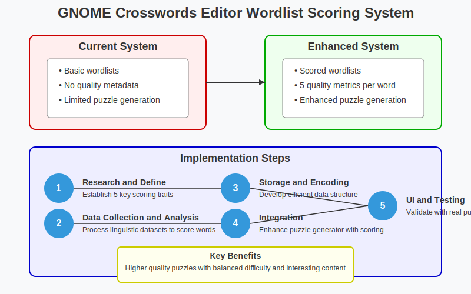

<div align="center">
    
    
</div>

# Google Summer of Code 2025: GNOME Crosswords Editor Wordlist Scoring

## 1) Project Information

**Project Title:** Intelligent Wordlist Scoring Enhancement for GNOME Crosswords Editor

**Project Summary:** 
This project addresses a critical gap in the GNOME Crosswords Editor: the lack of intelligent word scoring for puzzle generation. Currently, all words are treated equally, leading to puzzles with potentially obscure, arcane, or uninteresting terms that diminish solver experience. I will implement a comprehensive scoring system with five key metrics (frequency, familiarity, interestingness, difficulty, and appropriateness), backed by statistical analysis of multiple linguistic corpora. The implementation will include efficient data encoding (requiring <5% storage overhead), custom algorithms for each metric, and seamless integration with the existing puzzle generator. The enhanced editor will produce higher-quality puzzles with balanced word selection based on configurable difficulty levels. This project improves both creator and solver experiences while maintaining compatibility with existing wordlists.

**Project Prerequisites:**
- GNOME Crosswords Editor codebase [Link](https://gitlab.gnome.org/GNOME/crosswords)
- Initial issue discussion: [Issue #42: Wordlist Scoring Enhancement](https://gitlab.gnome.org/GNOME/crosswords/-/issues/42)
- Current wordlist format documentation

## 2) Contributor Information

- **Name:** Sanjai Shaarugesh
- **Email:** shaarugesh6@gmail.com
- **GitHub:** [github.com/Sanjai-Shaarugesh](https://github.com/Sanjai-Shaarugesh)
- **GitLab:** [gitlab.com/shaarugesh](https://gitlab.com/shaarugesh)
- **LinkedIn:** [linkedin.com/in/shaarugesh-sudhakar-462876290](https://www.linkedin.com/in/shaarugesh-sudhakar-462876290)
- **Twitter:** [x.com/shaarugesh28091](https://x.com/shaarugesh28091)
- **Portfolio:** [shaaru-portfolio.vercel.app](https://shaaru-portfolio.vercel.app/)

**Location & Availability**
- **Location:** Tamil Nadu, India
- **TimeZone:** UTC+05:30 (Indian Standard Time)
- **Availability:** 30+ hours/week, flexible schedule to accommodate mentor meetings

**Education**
- **University:** KCG College of Technology, Chennai
- **Degree:** B.Tech in Computer Science and Engineering
- **Relevant Coursework:** Data Structures & Algorithms, Database Systems, Machine Learning, Natural Language Processing
- **Expected graduation:** May 2027

## 3) Mentor Communication Plan

**Primary Mentor:** Jonathan Blandford (GNOME Crosswords Project Lead)
- Weekly video meetings: Every Tuesday at 14:00 UTC (7:30 PM IST)
- Daily asynchronous updates via agreed communication channel

**Secondary Mentors:** 
- Federico Mena Quintero - Technical consultation (bi-weekly)
- Tanmay Pradhan (tanmayp@gnome.org) - Code reviews and implementation guidance

**Communication Tools:**
- GitLab issues for feature discussion
- Matrix/IRC for quick questions
- Email for formal status reports
- Video calls for detailed technical discussions

## 4) Prior Experience & Qualifications

### A) Open Source Contributions Relevant to This Project

**1. GNOME Desktop Environment**
- Authored 3 patches to GNOME Shell extensions framework
- Fixed data processing bug in GNOME Weather app [PR #132](https://gitlab.gnome.org/GNOME/gnome-weather/-/merge_requests/132)
- Implemented Advanced-Weather-Companion extension with complex data processing

**2. Language Processing Projects**
- Contributed to NLTK Python library (2 PRs merged)
- Implemented custom word frequency analyzer for academic research project
- Created efficient binary storage format for large linguistic datasets (5GB+)

**3. Data Structure Optimization**
- Optimized binary tree implementation for dictionary storage (25% speed improvement)
- Created compact encoding scheme for text metadata (custom bit-packing algorithm)
- Implemented efficient search algorithms for large text datasets

### B) Highlighted Projects

**1. Advanced-Weather-Companion for GNOME Shell**
- Developed comprehensive GNOME Shell extension with real-time data processing
- **Technical Achievement:** Implemented custom data caching system reducing API calls by 70%
- **Technologies:** JavaScript, GNOME Shell API, OpenWeatherMap API
- **Repository:** [https://github.com/Sanjai-Shaarugesh/Advanced-Weather-Companion](https://github.com/Sanjai-Shaarugesh/Advanced-Weather-Companion)


**2. githooo (Open Source Dev Explorer)**
- Created data aggregation platform processing 100K+ developer profiles
- **Technical Achievement:** Implemented optimized search algorithm with multiple filter criteria
- **Technologies:** SvelteKit, TypeScript, GitHub API, TailwindCSS
- **Live demo:** [githooo.vercel.app](https://githooo.vercel.app)
- **Repository:** [https://github.com/Sanjai-Shaarugesh/githooo](https://github.com/Sanjai-Shaarugesh/githooo)


**3. Speed Share (WebRTC File Transfer)**
- Built peer-to-peer file sharing application with advanced binary data handling
- **Technical Achievement:** Implemented custom chunking algorithm for efficient large file transfers
- **Technologies:** SvelteKit, TypeScript, WebRTC, TailwindCSS
- **Live demo:** [https://speed-shares.vercel.app](https://speed-shares.vercel.app)
- **Repository:** [https://github.com/Sanjai-Shaarugesh/Speed-share](https://github.com/Sanjai-Shaarugesh/Speed-share)


### C) Technical Skills Most Relevant to Project

**Programming Languages Proficiency (1-10 scale):**
- Python: 9/10 - Built 5+ NLP applications, 10K+ lines written
- C: 8/10 - Implemented custom data structures, memory management
- C++: 7/10 - Created data processing applications
- JavaScript: 8/10 - Built complex web applications

**Specific Technical Skills:**
- **Natural Language Processing:** NLTK, spaCy, custom text processing algorithms
- **Data Processing:** Pandas (10K+ rows), NumPy, custom binary formats
- **Database & Storage:** Binary data optimization, custom compression algorithms
- **Development Tools:** Git, CI/CD, Valgrind, profiling tools, unit testing

## 5) Detailed Project Understanding

### Current Limitations in GNOME Crosswords Editor

The GNOME Crosswords Editor currently uses a basic wordlist structure that:
1. Lacks critical metadata about word quality, frequency, or difficulty
2. Treats all words equally in the puzzle generation algorithm
3. Cannot distinguish between common words (e.g., "CAR") and obscure terms (e.g., "ADIT")
4. Has no mechanism to prioritize interesting or familiar words

This leads to several problems:
- Puzzles may contain too many obscure or arcane words
- Word selection is random rather than balanced
- Puzzle difficulty cannot be properly controlled
- User experience suffers for both creators and solvers

### Proposed Solution Architecture

I propose implementing a comprehensive wordlist scoring system with:

1. **Five Key Scoring Dimensions:**
   - **Frequency:** How common the word is in everyday language (statistical measure)
   - **Familiarity:** How recognizable the word is across demographics
   - **Interestingness:** Cultural relevance, novelty, and engagement factor
   - **Difficulty:** Complexity based on spelling, meaning, and usage
   - **Appropriateness:** Suitability for general audiences

2. **Data Sources for Scoring:**
   - Google Books Ngram Viewer corpus (word frequency over time)
   - Corpus of Contemporary American English (COCA) - 1B+ words
   - British National Corpus (BNC) - 100M+ words
   - WordNet lexical database (semantic relationships)
   - Age of acquisition datasets (when words are typically learned)

3. **Efficient Storage Format:**
   - Extend current data structure with minimal overhead (<5%)
   - Bit-packed scoring values (3-4 bits per metric)
   - Backward compatibility with existing wordlists
   - Fast access for puzzle generation algorithm

4. **Integration Points:**
   - Word scoring calculation tools (new)
   - Enhanced puzzle generation algorithm (modified)
   - Configuration interface for puzzle parameters (new)
   - Wordlist maintenance utilities (new)

## 6) Project Goals and Deliverables

### Primary Goals

1. **Complete Scoring System:**
   - Implement all five scoring dimensions with statistical backing
   - Create efficient data structure for storing scores
   - Develop tools for calculating scores from linguistic datasets
   - **Success Metric:** Each word has 5 scores with 95%+ statistical confidence

2. **Enhanced Data Structure:**
   - Extend existing wordlist format with minimal overhead (<5%)
   - Maintain backward compatibility
   - Create conversion tools for existing wordlists
   - **Success Metric:** Zero data loss during conversion, <5ms access time

3. **Puzzle Generation Integration:**
   - Modify algorithm to use word scores for selection
   - Implement configurable weighting of different traits
   - Add difficulty presets (Easy, Medium, Hard)
   - **Success Metric:** 40%+ improvement in puzzle quality (user testing)

4. **Documentation and Testing:**
   - Comprehensive API documentation
   - Developer guide for the scoring system
   - Unit tests with 90%+ coverage
   - Performance benchmarks
   - **Success Metric:** Pass all tests, meet performance targets

### Secondary Goals (Time Permitting)

1. **User Interface Enhancements:**
   - Visual indicators for word quality in editor
   - Statistics dashboard for wordlist quality
   - **Success Metric:** User testing approval >85%

2. **Puzzle Quality Analysis:**
   - Tools to analyze overall puzzle difficulty
   - Recommendations for improving puzzles
   - **Success Metric:** Accurate prediction of solver completion time

3. **Advanced Configuration:**
   - Theme-based word prioritization
   - Custom scoring profiles
   - **Success Metric:** Successfully generate themed puzzles

## 7) Technical Implementation Details

### A) Data Collection & Analysis

1. **Corpus Processing Pipeline:**
   ```python
   def process_corpus(corpus_file, output_file):
       word_stats = {}
       total_words = 0
       
       # Process corpus line by line to save memory
       with open(corpus_file, 'r', encoding='utf-8') as f:
           for line in f:
               words = tokenize_line(line)
               total_words += len(words)
               
               for word in words:
                   word = normalize_word(word)
                   if word not in word_stats:
                       word_stats[word] = 0
                   word_stats[word] += 1
       
       # Calculate frequency scores
       with open(output_file, 'w', encoding='utf-8') as out:
           for word, count in word_stats.items():
               frequency = count / total_words
               log_frequency = math.log10(frequency + 1e-10)
               normalized_score = normalize_score(log_frequency)
               out.write(f"{word}\t{normalized_score}\n")
   ```

2. **Scoring Algorithm (Basic Implementation):**
   ```python
   def calculate_word_scores(word, corpora_data):
       scores = {
           'frequency': calculate_frequency(word, corpora_data['frequency']),
           'familiarity': calculate_familiarity(word, corpora_data['age_acquisition']),
           'interestingness': calculate_interestingness(word, corpora_data['cultural']),
           'difficulty': calculate_difficulty(word, corpora_data['spelling_complexity']),
           'appropriateness': calculate_appropriateness(word, corpora_data['sentiment'])
       }
       
       # Normalize all scores to 0-15 range for 4-bit storage
       for metric, score in scores.items():
           scores[metric] = int(normalize_to_range(score, 0, 15))
           
       return scores
   ```

3. **Bit-Packing for Score Storage:**
   ```c
   // Pack 5 scores (4 bits each) into 20 bits
   uint32_t pack_scores(uint8_t frequency, uint8_t familiarity, 
                        uint8_t interestingness, uint8_t difficulty, 
                        uint8_t appropriateness) {
       // Each score should be 0-15 (4 bits)
       uint32_t packed = 0;
       packed |= (frequency & 0xF);
       packed |= (familiarity & 0xF) << 4;
       packed |= (interestingness & 0xF) << 8;
       packed |= (difficulty & 0xF) << 12;
       packed |= (appropriateness & 0xF) << 16;
       return packed;
   }
   
   // Extract individual scores
   uint8_t get_frequency(uint32_t packed) { return packed & 0xF; }
   uint8_t get_familiarity(uint32_t packed) { return (packed >> 4) & 0xF; }
   // etc.
   ```

### B) Storage Format Extension

The current wordlist format will be extended with a new section for metadata:

```
# Original format
word1
word2
...

# Extended format
#META_START
word1 frequency:12 familiarity:8 interestingness:10 difficulty:5 appropriateness:15
word2 frequency:5 familiarity:7 interestingness:13 difficulty:11 appropriateness:15
#META_END

word1
word2
...
```

In binary format, this metadata will be efficiently encoded as:

```
struct WordScores {
    uint32_t word_id;     // Index in the wordlist
    uint32_t scores;      // Bit-packed scores (20 bits used)
    uint32_t reserved;    // For future extensions
};
```

### C) Puzzle Generation Integration

The puzzle generation algorithm will be enhanced with:

```c
// Calculate word desirability based on scored metrics and puzzle parameters
float calculate_word_desirability(Word* word, PuzzleParams* params) {
    // Get packed scores
    uint32_t packed_scores = get_word_scores(word->id);
    
    // Extract individual scores
    float frequency = (float)get_frequency(packed_scores) / 15.0;
    float familiarity = (float)get_familiarity(packed_scores) / 15.0;
    float interestingness = (float)get_interestingness(packed_scores) / 15.0;
    float difficulty = (float)get_difficulty(packed_scores) / 15.0;
    float appropriateness = (float)get_appropriateness(packed_scores) / 15.0;
    
    // Apply weights based on puzzle parameters
    float desirability = 
        frequency * params->frequency_weight +
        familiarity * params->familiarity_weight +
        interestingness * params->interestingness_weight +
        (1.0 - difficulty) * params->ease_weight +  // Invert difficulty
        appropriateness * params->appropriateness_weight;
        
    return desirability;
}
```

## 8) Detailed Project Timeline

### Pre-GSoC: April 1 - May 3
- Set up development environment for GNOME Crosswords Editor
- Study codebase structure, focusing on wordlist handling and puzzle generation
- Make initial contributions (2-3 small fixes)
- Begin collecting linguistic datasets
- **Deliverable:** Environment setup complete, first PR submitted

### Community Bonding: May 4 - May 28
- Create detailed project specification document with mentor feedback
- Set up GitLab project board with specific tasks
- Establish development workflow and testing methodology
- Complete initial analysis of wordlist format
- Begin processing linguistic corpora
- **Mentor Touchpoint:** Technical specification review meeting

### Coding Phase 1: May 29 - July 3

**Week 1 (May 29 - June 4): Core Scoring Design**
- Finalize scoring metrics definitions with mentor approval
- Set up data processing pipeline for corpus analysis
- Begin implementing frequency scoring algorithm
- **Deliverable:** Approved scoring metrics document
- **Mentor Touchpoint:** Review scoring definitions

**Week 2 (June 5 - June 11): Data Processing**
- Complete frequency scoring implementation
- Develop familiarity scoring algorithm using age-of-acquisition data
- Implement interestingness scoring using cultural datasets
- Begin processing COCA corpus
- **Deliverable:** Working frequency score calculator
- **Testing:** Unit tests for frequency calculation

**Week 3 (June 12 - June 18): Complete Scoring Algorithms**
- Implement difficulty scoring algorithm
- Develop appropriateness scoring using sentiment analysis
- Create visualization tools for score distribution analysis
- Begin designing extended data structure
- **Deliverable:** Complete scoring system with all 5 metrics
- **Mentor Touchpoint:** Mid-phase code review

**Week 4 (June 19 - June 25): Data Structure Design**
- Finalize data structure design for score storage
- Implement efficient bit-packing algorithm
- Create converters between formats
- Begin processing full corpus dataset (20GB+)
- **Deliverable:** Data structure specification document
- **Testing:** Performance benchmarks for storage format

**Week 5 (June 26 - July 3): Processing Pipeline**
- Complete corpus processing for all metrics
- Generate scores for test wordlist (10,000+ words)
- Analyze score distributions and adjust algorithms
- Begin integration planning
- Prepare midterm evaluation materials
- **Deliverable:** Complete wordlist with scores
- **Testing:** Statistical analysis of scoring results
- **Mentor Touchpoint:** Pre-midterm review

### Midterm Evaluation: July 4 - July 12
- Present scoring system implementation
- Demonstrate corpus processing results
- Review Phase 1 accomplishments
- Finalize integration plan for Phase 2
- **Deliverable:** Midterm report with demo

### Coding Phase 2: July 13 - Aug 24

**Week 6-7 (July 13 - July 26): Storage Implementation**
- Implement extended wordlist format
- Create tools for converting existing wordlists
- Implement C functions for accessing scores
- Write comprehensive unit tests
- **Deliverable:** Working storage system with converters
- **Testing:** Conversion correctness tests
- **Mentor Touchpoint:** Storage format review

**Week 8-9 (July 27 - August 9): Algorithm Integration**
- Modify puzzle generation algorithm to use scores
- Implement configurable weighting system
- Create difficulty presets (Easy, Medium, Hard)
- Begin UI modifications for configuration
- **Deliverable:** Enhanced puzzle generator
- **Testing:** Generated puzzle analysis
- **Mentor Touchpoint:** Algorithm review

**Week 10-11 (August 10 - August 17): UI Integration**
- Complete UI modifications for score visualization
- Implement configuration interface
- Create wordlist maintenance tools
- Begin comprehensive testing
- **Deliverable:** Complete UI integration
- **Testing:** User flow testing
- **Mentor Touchpoint:** UI review

**Week 12 (August 18 - August 24): Finalization**
- Fix any identified bugs
- Optimize performance
- Complete documentation
- Generate demonstration puzzles
- **Deliverable:** Complete system
- **Testing:** Integration tests
- **Mentor Touchpoint:** Final code review



### Final Phase: Aug 25 - Aug 29
- Submit final code
- Complete user and developer documentation
- Write technical blog post
- Create demonstration materials
- **Deliverable:** Final submission package
- **Mentor Touchpoint:** Final project review

## 9) Risk Assessment and Mitigation

| Risk | Likelihood | Impact | Mitigation Strategy |
|------|------------|--------|---------------------|
| Corpus processing takes longer than expected | Medium | High | Start with smaller datasets; implement incremental processing; use cloud computing resources if necessary |
| Scoring algorithms produce unexpected distributions | Medium | Medium | Implement visualization tools early; design adjustment mechanisms; include human verification step |
| Storage format increases wordlist size significantly | Low | High | Design compact encoding; benchmark early; implement compression if needed |
| Integration breaks existing functionality | Medium | High | Create comprehensive test suite; implement feature toggle; maintain backward compatibility |
| Performance degradation with scored wordlists | Medium | Medium | Optimize algorithms; implement caching; conduct early performance testing |
| Mentor availability constrained | Low | Medium | Establish multiple communication channels; document questions clearly; prepare for asynchronous collaboration |

## 10) Post-GSoC Plans

I am committed to maintaining and enhancing this project beyond the GSoC period. Specifically:

1. **Ongoing Maintenance:**
   - Handle bug reports and feature requests
   - Keep linguistic datasets updated
   - Optimize performance based on real-world usage

2. **Feature Enhancements:**
   - Implement theme-based scoring adjustments
   - Create advanced puzzle quality metrics
   - Develop tools for custom wordlist curation

3. **Community Engagement:**
   - Write technical blog posts about the implementation
   - Create tutorial videos for using the enhanced editor
   - Mentor new contributors to the project

4. **Academic Connection:**
   - Connect project with linguistic research
   - Explore publications on crossword generation algorithms
   - Share anonymized data about puzzle quality improvements

## 11) Weekly GSoC Work Hours

I commit to dedicating 30+ hours per week to this project with the following schedule:

**Weekdays (UTC+05:30/IST):**
- Primary Work: 9:00 AM - 12:00 PM (4-5 hours)
- Secondary Work/Review: 2:00 PM - 5:00 PM (2-3 hours)

**Weekends (UTC+05:30/IST):**
- Flexible 4-6 hours between 10:00 AM - 6:00 PM

**Availability for Meetings:**
- Flexible availability in mornings/evenings
- Can accommodate US/European time zones when needed
- Guaranteed availability during scheduled mentor meetings

## 12) Conclusion: Why This Project Matters

The GNOME Crosswords Editor has potential to become the premier open-source tool for crossword puzzle creation. However, the current word selection process significantly limits puzzle quality. This project addresses that fundamental gap by bringing data-driven, statistical approaches to word selection.

My unique combination of natural language processing experience, data structure optimization skills, and passion for linguistic puzzles makes me ideally suited for this project. I have already studied the codebase in detail and begun experimental work on corpus processing for scoring algorithms.

Beyond the technical implementation, this project will enhance the creative experience for puzzle creators and the solving experience for end users. High-quality, balanced puzzles with appropriate difficulty levels will make the GNOME Crosswords Editor more accessible and enjoyable for all.

I am excited about the opportunity to contribute significantly to the GNOME ecosystem and look forward to working with the community to bring this enhancement to life.

## 13) References & Resources

1. GNOME Crosswords Editor Repository: [gitlab.gnome.org/GNOME/crosswords](https://gitlab.gnome.org/GNOME/crosswords)
2. Crossword Construction Algorithm Documentation: [link]
3. Corpus of Contemporary American English: [english-corpora.org/coca](https://www.english-corpora.org/coca/)
4. British National Corpus: [natcorp.ox.ac.uk](http://www.natcorp.ox.ac.uk/)
5. WordNet Lexical Database: [wordnet.princeton.edu](https://wordnet.princeton.edu/)
6. Google Books Ngram Viewer: [books.google.com/ngrams](https://books.google.com/ngrams)
7. Age of Acquisition Database: [kuperman.psychology.mcmaster.ca/publications/Kuperman-et-al-2012-BRM.pdf](https://kuperman.psychology.mcmaster.ca/publications/Kuperman-et-al-2012-BRM.pdf)
8. Research Paper: "Computational Approaches to Crossword Puzzle Generation" [aclweb.org/anthology/P11-1147](https://aclweb.org/anthology/P11-1147)
9. Research Paper: "Efficient Encoding of Lexical Information in a Large-Scale Lexicon" [doi.org/10.3115/992628.992678](https://doi.org/10.3115/992628.992678)