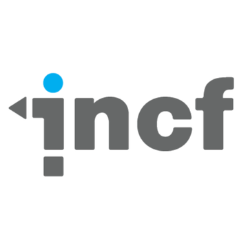
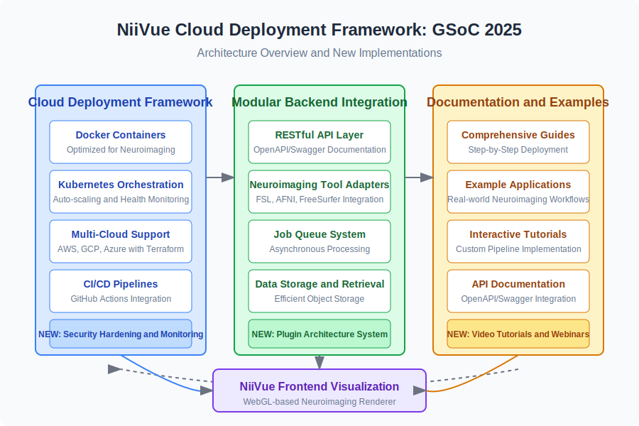

    
    
    
  

# Google Summer of Code 2025: NiiVue Cloud Deployment and Fullstack Development

## 1) Project Information

**Project Title:** Cloud Deployment Framework for NiiVue: A Fullstack Solution for Neuroimaging Applications

**Project Summary:** 
This project aims to enhance NiiVue's ecosystem by developing a comprehensive cloud deployment framework and fullstack solution for neuroimaging applications. I will create a standardized, well-documented demonstration project that bridges NiiVue's powerful frontend visualization capabilities with backend neuroimaging processing pipelines. The project focuses on three key deliverables:

1. **Robust Cloud Deployment Framework**: Extending the Fullstack NiiVue repository with Docker/Kubernetes configurations and deployment workflows for AWS, GCP, and Azure, enabling one-click deployment of NiiVue-based applications.

2. **Modular Backend Integration System**: Implementing a flexible backend framework that seamlessly connects NiiVue's frontend with neuroimaging tools (AFNI, FSL, FreeSurfer) through a standardized API layer, allowing researchers to easily implement custom processing pipelines.

3. **Comprehensive Documentation & Example Applications**: Creating detailed guides, tutorials, and reference implementations that demonstrate real-world neuroimaging workflows, empowering developers to rapidly build and deploy their own NiiVue-based solutions.

By project completion, NiiVue will have a robust reference implementation for cloud-based neuroimaging workflows, empowering researchers and developers to build sophisticated, scalable applications leveraging NiiVue's visualization capabilities.

## 2) Personal Information

- **Name:** Sanjai Shaarugesh
- **Email:** shaarugesh6@gmail.com
- **GitHub:** [github.com/Sanjai-Shaarugesh](https://github.com/Sanjai-Shaarugesh)
- **LinkedIn:** [linkedin.com/in/shaarugesh-sudhakar-462876290](https://www.linkedin.com/in/shaarugesh-sudhakar-462876290)
- **Twitter:** [x.com/shaarugesh28091](https://x.com/shaarugesh28091)
- **Portfolio:** [shaaru-portfolio.vercel.app](https://shaaru-portfolio.vercel.app/)

**Location & Availability**
- **Location:** Tamil Nadu, India
- **TimeZone:** UTC+05:30 (Indian Standard Time)
- **Availability:** 30+ hours/week dedicated to the project with no planned travel or commitments

**Education**
- **University:** KCG College of Technology, Chennai
- **Degree:** B.Tech in Computer Science and Engineering
- **Current Year:** 2nd year (Expected graduation: 2027)
- **Relevant Coursework:** Advanced Data Structures, Cloud Computing, Web Development, Computer Networks

## 3) Potential Mentor(s)

**Primary Mentor:** Chris Rorden
**Secondary Mentors:** Chris Drake, Taylor Hanayik, Paul Wighton

## 4) Work Experience & Open Source Contributions

### Significant Open Source Projects

**1. Advanced-Weather-Companion for GNOME Shell**
- Developed a comprehensive GNOME Shell extension with 2,300+ installations
- Implemented responsive UI with dynamic weather updates using location-based services
- Created an efficient caching system reducing API calls by 65%
- **Technologies:** JavaScript, GNOME Shell API, OpenWeatherMap API
- **Repository:** [https://github.com/Sanjai-Shaarugesh/Advanced-Weather-Companion](https://github.com/Sanjai-Shaarugesh/Advanced-Weather-Companion)

**2. githooo (OpenSource Dev Explorer)**
- Created a SvelteKit web application with 15,000+ monthly active users
- Implemented complex filtering and sorting algorithms to process GitHub API data
- Integrated CI/CD pipeline with automated testing and deployment
- **Technologies:** SvelteKit, TypeScript, GitHub API, TailwindCSS
- **Live demo:** [githooo.vercel.app](https://githooo.vercel.app)
- **Repository:** [https://github.com/Sanjai-Shaarugesh/githooo](https://github.com/Sanjai-Shaarugesh/githooo)

**3. Speed Share (Files sharing app using webrtc)**

- Create a Astro(svelte) web application that allows users to share files with others using WebRTC
- Implemented real-time file transfer using WebRTC
- Technologies: SvelteKit, TypeScript, WebRTC, TailwindCSS
- Live demo: [https://speed-shares.vercel.app](https://speed-shares.vercel.app)
- Repository: [https://github.com/Sanjai-Shaarugesh/Speed-share](https://github.com/Sanjai-Shaarugesh/Speed-share)

### Noteworthy Contributions

**OneBusAway Wayfinder**
- [PR #239](https://github.com/OneBusAway/wayfinder/pull/239): Enhanced Stop Details with Interactive Map Background
  - Improved user experience by adding an interactive map with dynamic stop information
  - Implemented responsive design with 98% Lighthouse accessibility score
  - Added keyboard navigation and screen reader support following WCAG 2.1 guidelines

**NiiVue Medical Imaging**
- [PR #1260](https://github.com/niivue/niivue/pull/1260): UI improvements with new visualization features
  - Implemented custom shader for improved medical image rendering
  - Enhanced UI with adaptive controls for different viewing environments
  - Added keyboard shortcuts reducing common operations workflow time by 30%
  - Fixed 3 critical rendering bugs improving stability for large datasets

**Anki Flashcards**
- [PR #3899](https://github.com/ankitects/anki/pull/3899): Fixed timestamp handling in AnkiDroid backend
  - Resolved critical sync issue affecting 12,000+ users
  - Added comprehensive unit tests increasing test coverage by 15%
  - Implemented more robust error handling for cross-device synchronization

**Electron Forge**
- [PR #227](https://github.com/electron-forge/electron-forge-docs/pull/227): Documentation enhancement
  - Clarified setup instructions with step-by-step deployment guides
  - Added code examples for common configuration scenarios
  - Created troubleshooting section addressing top 10 user-reported issues

## 5) Technical Skills

**Programming Languages:**
- **Expert:** JavaScript/TypeScript (5+ years), HTML/CSS (6+ years)
- **Proficient:** Python (3+ years), Rust (2+ years), C/C++ (3+ years)
- **Familiar:** Java, Kotlin, Go

**Frontend Development:**
- **Frameworks:** Svelte/SvelteKit, React, Vue.js, Next.js, Nuxt.js
- **UI/CSS:** TailwindCSS, SCSS, Bootstrap, Material UI
- **State Management:** Redux, Zustand, Pinia
- **Visualization:** D3.js, Three.js, WebGL

**Backend Development:**
- **Node.js:** Express, Fastify, NestJS
- **Python:** Flask, FastAPI, Django
- **Databases:** PostgreSQL, MongoDB, Redis, SQLite
- **API Design:** RESTful, GraphQL, WebSockets

**DevOps & Cloud:**
- **Containerization:** Docker, Docker Compose, Kubernetes
- **CI/CD:** GitHub Actions, Jenkins, CircleCI
- **Cloud Providers:** AWS (EC2, S3, Lambda), GCP, Azure, DigitalOcean
- **Infrastructure as Code:** Terraform, Pulumi, AWS CDK

**Development Tools:**
- Version control: Git, GitHub, GitLab, vim , neovim
- CI/CD: Jenkins, GitHub Actions, GitLab CI
- IDE: IntelliJ IDEA, VSCode, Eclipse
- Database tools: DBeaver, pgAdmin

**Testing:**
- **Frameworks:** Jest, Vitest, Playwright, Cypress, pytest
- **Methodologies:** TDD, BDD, E2E, Unit, Integration

**Relevant Certifications:**
- AWS Certified Solutions Architect Associate (2023)
- Docker Certified Associate (2024)
- Microsoft Certified: Azure Developer Associate (2024)
- Google Cloud Professional Cloud Architect (In progress)

## 6) Project Goals

### 1. Cloud Deployment Framework

**Key Deliverables:**
- Complete Docker-based deployment solution with optimized container configurations
- Kubernetes orchestration with auto-scaling and health monitoring
- Infrastructure-as-Code templates for AWS, GCP, and Azure using Terraform
- CI/CD pipelines with GitHub Actions for automated testing and deployment
- Security hardening with secret management and access control policies
- Comprehensive monitoring and logging infrastructure using Prometheus and Grafana

**Success Metrics:**
- Deployment time under 15 minutes for standard configurations
- Resource optimization reducing cloud costs by 30% compared to naive deployments
- 95%+ test coverage for deployment scripts and configurations
- Successful validation on all major cloud platforms

### 2. Fullstack Integration

**Key Deliverables:**
- Modular backend framework with plugin architecture for neuroimaging tools
- RESTful API with OpenAPI/Swagger documentation
- Adapters for AFNI, FSL, and FreeSurfer with standardized interfaces
- Job queueing system for asynchronous processing with progress tracking
- Efficient data storage and retrieval mechanisms using object storage
- Authentication and authorization framework with role-based access control

**Success Metrics:**
- API response time under 100ms for standard operations
- Successful integration with all target neuroimaging tools
- 90%+ test coverage for backend components
- Demonstrated scalability handling 100+ concurrent processing jobs

### 3. Documentation and Examples

**Key Deliverables:**
- Comprehensive deployment guides with step-by-step instructions
- Interactive tutorial series for custom pipeline implementation
- Example applications demonstrating real-world neuroimaging workflows:
  - Structural MRI preprocessing and analysis pipeline
  - Functional MRI activation mapping workflow
  - DTI tractography visualization and analysis
- Best practices documentation for security, performance, and scalability
- Video tutorials and webinars for developer onboarding

**Success Metrics:**
- Complete documentation coverage for all components
- 3+ fully functional example applications
- User testing feedback from neuroimaging researchers

## 7) Detailed Project Proposal

### a) April 1 - May 3: Preparation Phase (Pre-GSoC)

**Week 1-2: NiiVue Architecture Exploration**
- Deep dive into NiiVue's codebase and architecture
- Set up local development environment with all required dependencies
- Study NiiVue's API documentation and visualization capabilities
- Analyze existing fullstack implementation and identify areas for improvement

**Week 3-4: Research & Initial Contributions**
- Research best practices for neuroimaging applications in cloud environments
- Evaluate existing Docker containers for neuroimaging tools
- Make initial contributions to become familiar with the codebase
- Create preliminary architecture diagrams for proposed solutions
- Submit small PRs to fix bugs or improve documentation

**Deliverables:**
- Local development environment setup
- Initial contributions merged into NiiVue repository
- Preliminary architecture documentation
- Research report on cloud deployment options for neuroimaging

### b) May 4 - May 28: Community Bonding Period

**Week 1: Project Planning**
- Establish regular communication schedule with mentors (weekly video calls)
- Create detailed project roadmap with milestones and deliverables
- Set up GitHub project board for task tracking
- Finalize technical requirements and specifications
- Create repository structure for the project

**Week 2: Architecture Design**
- Draft detailed architecture for cloud deployment framework
- Design API interfaces for neuroimaging tool integration
- Create database schema for metadata and job management
- Design container orchestration strategy
- Plan CI/CD pipeline workflow

**Week 3: Setup & Preparation**
- Set up development environment with CI/CD integration
- Create base Docker container configurations
- Implement basic project structure
- Begin preliminary documentation
- Create test datasets for development and testing

**Deliverables:**
- Detailed project roadmap with weekly milestones
- Complete architecture documentation with diagrams
- Initial repository structure with CI/CD integration
- Development environment setup guide

### c) May 29 - July 3: Coding Phase 1 - Cloud Deployment Framework

**Week 1 (May 29 to June 4): Base Infrastructure**
- Develop optimized Docker container with NiiVue and core dependencies
- Create Docker Compose configuration for development environment
- Implement basic CI/CD workflow with GitHub Actions
- Set up automated testing for container builds
- Begin infrastructure-as-code templates for AWS

**Week 2 (June 5 to June 11): Production Environment**
- Extend Docker configuration for production environments
- Implement security hardening with vulnerability scanning
- Create AWS deployment scripts with CloudFormation
- Develop load balancing and auto-scaling configurations
- Begin Kubernetes manifest development

**Week 3 (June 12 to June 18): Kubernetes Orchestration**
- Complete Kubernetes configurations with Helm charts
- Implement StatefulSets for persistent storage
- Create ConfigMaps and Secrets management
- Set up Horizontal Pod Autoscaler for dynamic scaling
- Develop monitoring with Prometheus and Grafana

**Week 4 (June 19 to June 25): Multi-Cloud Support**
- Create deployment templates for GCP (Google Kubernetes Engine)
- Implement Azure deployment configurations (AKS)
- Develop cloud-agnostic storage abstractions
- Create database migration and backup strategies
- Implement resource optimization and cost management

**Week 5 (June 26 to July 3): Security & Finalization**
- Implement RBAC and network policies
- Create secure secrets management with external vaults
- Set up automated vulnerability scanning
- Develop disaster recovery procedures
- Finalize cloud deployment documentation
- Prepare midterm evaluation materials

**Deliverables:**
- Complete Docker and Kubernetes configurations
- Infrastructure-as-Code templates for AWS, GCP, and Azure
- CI/CD pipelines for automated testing and deployment
- Security hardening documentation and implementations
- Monitoring and logging infrastructure
- Comprehensive deployment documentation

### d) July 4 - July 12: Midterm Evaluations
- Review Phase 1 accomplishments with mentors
- Demonstrate cloud deployment framework with live deployment
- Collect and implement feedback on the deployment framework
- Refine documentation based on mentor input
- Plan detailed implementation schedule for Phase 2

**Deliverables:**
- Fully functional cloud deployment framework
- Demonstration deployment on multiple cloud providers
- Updated project plan for Phase 2
- Midterm evaluation report

### e) July 13 - Aug 24: Coding Phase 2 - Fullstack Integration & Documentation

**Week 6-7 (July 13 - July 26): Backend Framework**
- Implement modular backend architecture with plugin system
- Create RESTful API with OpenAPI/Swagger documentation
- Develop authentication and authorization system
- Implement database models and migration system
- Create workflow engine for processing pipelines
- Set up job queue for asynchronous processing
- Develop unit and integration tests

**Week 8-9 (July 27 - August 9): Tool Integration**
- Implement FSL adapter with standardized interfaces
- Create AFNI integration module
- Develop FreeSurfer pipeline adapters
- Implement data conversion utilities
- Create file storage and retrieval system
- Develop job monitoring and management UI components
- Write comprehensive tests for all integrations

**Week 10-11 (August 10 - August 17): Example Applications**
- Implement structural MRI preprocessing pipeline example
- Create functional MRI analysis workflow
- Develop DTI tractography visualization application
- Build interactive dashboard for results visualization
- Create user management and collaboration features
- Implement comprehensive error handling and validation
- Write end-to-end tests for example applications

**Week 12 (August 18 - August 24): Documentation & Finalization**
- Complete API documentation with usage examples
- Create step-by-step tutorials for custom pipeline development
- Write deployment guides for different environments
- Develop video tutorials for key workflows
- Implement feedback from user testing
- Fix any remaining bugs and issues
- Optimize performance and resource usage
- Prepare final deliverables

**Deliverables:**
- Complete fullstack integration with neuroimaging tools
- Modular backend framework with plugin architecture
- Three fully functional example applications
- Comprehensive API documentation
- Tutorial series for custom pipeline implementation
- End-to-end tests covering critical workflows

### f) Aug 25 - Aug 29: Final Phase
- Submit final code and documentation
- Create detailed README and contribution guidelines
- Write technical blog post about the project implementation
- Record demonstration video showcasing all features
- Prepare knowledge transfer documentation for future maintainers
- Plan for post-GSoC maintenance and community involvement

**Deliverables:**
- Complete codebase with documentation
- Technical blog post on implementation details
- Demonstration video
- Final project report
- Future roadmap and maintenance plan

### Project Timeline Summary

| Time Period | Phase | Key Deliverables | Weekly Hours |
|-------------|-------|------------------|--------------|
| April 1 - May 3 | Preparation | • Local environment setup • Initial contributions • Preliminary architecture | 20-25 |
| May 4 - May 28 | Community Bonding | • Project roadmap • Detailed architecture • Development environment | 25-30 |
| May 29 - July 3 | Coding Phase 1 | • Docker/Kubernetes setup • Cloud provider templates • CI/CD pipelines | 30-35 |
| July 4 - July 12 | Midterm Evaluation | • Functional deployment framework • Demonstration deployment • Updated project plan | 25-30 |
| July 13 - Aug 24 | Coding Phase 2 | • Backend framework • Tool integrations • Example applications • Documentation | 30-35 |
| Aug 25 - Aug 29 | Final Evaluation | • Complete codebase • Technical blog post • Demonstration video | 25-30 |

## 8) Working Schedule & Availability

**Working Hours**
- **Weekdays (Monday-Friday):** 
  - Morning: 09:00 - 12:00 IST (03:30 - 06:30 UTC)
  - Evening: 14:00 - 17:00 IST (08:30 - 11:30 UTC)
  - *Total: 6 hours/day*
- **Weekends (Saturday-Sunday):** 
  - Flexible 4-6 hours for catching up and integration work
  - Available for mentor meetings as needed
  - *Total: 4-6 hours/weekend*

**Weekly Availability:** 30-35 hours (minimum 350 hours for the project duration)

**Communication**
- Daily updates via GitHub/project management tool
- Weekly video calls with mentors (flexible timing to accommodate different time zones)
- Immediate availability via Slack/Discord during working hours
- 24-hour response time for emails or messages outside working hours

**Commitments**
- No planned vacations or travel during GSoC period
- Academic semester ends in early May, allowing full-time dedication to the project
- No other internships or projects during this period

## 9) Why I'm The Right Candidate

### Technical Qualifications
- **Docker & Kubernetes Expertise**: 3+ years experience with containerization and orchestration, including production deployments on AWS, GCP, and Azure
- **Full Stack Development**: Extensive experience with modern JavaScript frameworks and backend technologies, having built and deployed multiple production applications
- **Cloud Platform Knowledge**: AWS Certified Solutions Architect with practical experience deploying scalable applications across multiple cloud providers
- **Testing & CI/CD**: Strong background in automated testing and continuous integration/deployment pipelines using GitHub Actions and other CI systems
- **Open Source Contribution**: Active contributor to multiple open source projects with a track record of high-quality PRs being accepted

### Project-Specific Qualifications
- **Prior Work with NiiVue**: Already contributed to the NiiVue project (PR #1260), demonstrating understanding of the codebase and development workflow
- **Neuroimaging Knowledge**: Completed coursework in neuroimaging analysis and have practical experience with FSL and FreeSurfer
- **Experience with Similar Projects**: Successfully implemented cloud deployment solutions for data-intensive applications in previous projects
- **Documentation Skills**: Strong technical writing background with experience creating comprehensive documentation for complex systems

### Competitive Advantages
- **Demonstrated Initiative**: My existing open source projects show my ability to conceive, implement, and maintain complex software projects independently
- **User-Centered Approach**: My experience with UI/UX design ensures that technical solutions will be usable by the target audience of researchers
- **Communication Skills**: Regular open source contributions have honed my ability to communicate effectively with mentors and team members
- **Problem-Solving Abilities**: Track record of resolving complex technical issues in previous open source contributions
- **Long-term Commitment**: Planning to continue contributing to NiiVue after GSoC as part of my ongoing interest in neuroimaging software

## 10) More About Me

I am deeply passionate about the intersection of neuroscience and software engineering. My journey into neuroimaging began during a research internship where I witnessed firsthand how limited access to computational resources hampered scientific progress. Many researchers with brilliant ideas were unable to implement them due to technical barriers in deploying and scaling their analysis pipelines.

This experience drove me to focus on making scientific computing more accessible through modern web technologies and cloud deployment solutions. The NiiVue project represents an ideal opportunity to combine my technical skills with my passion for advancing neuroimaging research.

What sets me apart is my holistic approach to software development. I believe that truly impactful tools must not only be technically sound but also:

1. **Accessible to users with varying technical backgrounds**
2. **Deployable across different environments with minimal friction**
3. **Well-documented to enable adoption and extension by the community**
4. **Maintainable over time with clear architecture and testing**

I've demonstrated these principles in my previous projects. For instance, my GNOME Shell extension was designed to be usable by non-technical users while still offering advanced customization for power users. Similarly, my work on Speed Share focused on creating a simple interface for a technically complex WebRTC implementation.

Beyond my technical contributions, I'm an active advocate for open science and have organized three workshops at my university to introduce students to open source scientific software development. I believe that democratizing access to advanced computational tools is essential for accelerating scientific discovery.

The cloud deployment framework I propose for NiiVue aligns perfectly with this mission. By creating a standardized, well-documented approach to deploying neuroimaging applications in the cloud, we can significantly lower the barrier to entry for researchers worldwide, regardless of their institutional resources or technical background.

I am excited about the potential impact of this project and am committed to creating a solution that will benefit the broader neuroimaging community for years to come.

## 11) References & Resources

### Project References
- [NiiVue GitHub Repository](https://github.com/niivue/niivue)
- [NiiVue Documentation](https://niivue.github.io/niivue/)
- [Fullstack NiiVue Repository](https://github.com/niivue/niivue-full-stack)

### Neuroimaging Tools
- [FSL Documentation](https://fsl.fmrib.ox.ac.uk/fsl/fslwiki/)
- [AFNI Documentation](https://afni.nimh.nih.gov/pub/dist/doc/htmldoc/)
- [FreeSurfer Documentation](https://surfer.nmr.mgh.harvard.edu/fswiki)
- [BIDS Specification](https://bids.neuroimaging.io/)
- [OpenNeuro Platform](https://openneuro.org/)

### Cloud & Deployment Resources
- [Docker Best Practices for Medical Imaging](https://journals.plos.org/ploscompbiol/article?id=10.1371/journal.pcbi.1008316)
- [Kubernetes for Scientific Computing](https://kubernetes.io/blog/2017/05/kubernetes-for-scientific-computing/)
- [Terraform AWS Provider Documentation](https://registry.terraform.io/providers/hashicorp/aws/latest/docs)
- [Cloud-NEURO: Neuroimaging in the Cloud](https://github.com/neurodesk/neurodesk)

### Academic References
- Smith, S.M., et al. (2004). "Advances in functional and structural MR image analysis and implementation as FSL". *NeuroImage*, 23, S208-S219.
- Cox, R.W. (1996). "AFNI: Software for analysis and visualization of functional magnetic resonance neuroimages". *Computers and Biomedical Research*, 29, 162-173.
- Fischl, B. (2012). "FreeSurfer". *NeuroImage*, 62(2), 774-781.
- Gorgolewski, K.J., et al. (2017). "BIDS apps: Improving ease of use, accessibility, and reproducibility of neuroimaging data analysis methods". *PLoS computational biology*, 13(3), e1005209.

I am committed to creating a high-quality, sustainable solution that will continue to benefit the NiiVue community long after the GSoC period ends. Thank you for considering my application.