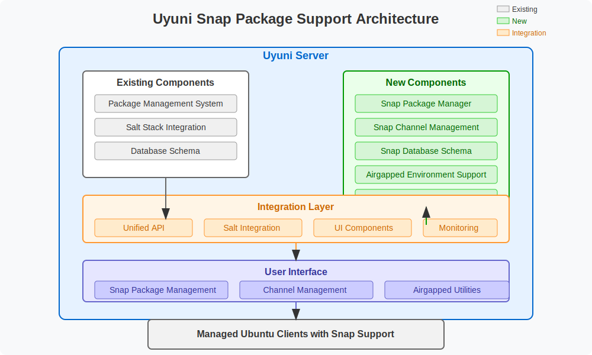

   
   
 

# Google Summer of Code 2025: Uyuni - Support for Ubuntu Snap Packages

## 1) Project Information

**Project Title:** Support for Ubuntu Snap Packages in Uyuni

**Project Summary:** This project aims to integrate comprehensive Snap package management capabilities into Uyuni, addressing a critical gap in its Ubuntu support. Since Ubuntu 22.04 LTS, Snap package technology has gained significant traction, and with Ubuntu 24.04 LTS, many traditional deb packages are being migrated to Snap. My implementation will enable Uyuni administrators to: (1) install, update, and remove Snap packages across their Ubuntu fleet, (2) manage Snap channels (stable, candidate, beta, edge) for granular control over software deployment, and (3) handle Snap packages in airgapped environments where direct internet access is restricted. By project completion, Uyuni will have robust support for modern Ubuntu environments, ensuring organizations can maintain consistent management practices as the ecosystem evolves toward Snap-based distribution.

## 2) Contributor Information

- **Name:** Sanjai Shaarugesh
- **Email:** shaarugesh6@gmail.com
- **GitHub:** [github.com/Sanjai-Shaarugesh](https://github.com/Sanjai-Shaarugesh)
- **LinkedIn:** [linkedin.com/in/shaarugesh-sudhakar-462876290](https://www.linkedin.com/in/shaarugesh-sudhakar-462876290)
- **Twitter:** [x.com/shaarugesh28091](https://x.com/shaarugesh28091)
- **Portfolio:** [shaaru-portfolio.vercel.app](https://shaaru-portfolio.vercel.app/)

**Birthplace & Location**
- **Location:** Tamil Nadu, India
- **TimeZone:** UTC+05:30 (Indian Standard Time)

**Education**
- **University:** KCG College of Technology, Chennai
- **Degree:** B.Tech
- **Field of study:** Computer Science and Engineering
- **Current year:** 2nd year (Expected graduation: 2027)

## 3) Potential Mentor(s)

- **Primary Mentor:** [m-czernek](https://github.com/m-czernek)
- **Secondary Mentors:** [wweellddeerr](https://github.com/wweellddeerr), [admd](https://github.com/admd)

## 4) Personal Background

### Work Experience & Open Source Contributions

#### Significant Open Source Projects

1. **Advanced-Weather-Companion for GNOME Shell**
   - Developed a comprehensive GNOME Shell extension that provides daily, hourly, and weekly weather forecasts
   - Implemented responsive UI with dynamic updates based on location services
   - Technologies: JavaScript, GNOME Shell API, OpenWeatherMap API
   - Repository: https://github.com/Sanjai-Shaarugesh/Advanced-Weather-Companion

   

2. **githooo (OpenSource Dev Explorer)**
   - Created a SvelteKit web application that aggregates and displays profiles of open source developers from GitHub
   - Implemented features like filtering, sorting, and detailed profile views
   - Technologies: SvelteKit, TypeScript, GitHub API, TailwindCSS
   - Live demo: githooo.vercel.app
   - Repository: https://github.com/Sanjai-Shaarugesh/githooo

   

3. Speed Share (Files sharing app using webrtc)**

   
   
   
   - Create a Astro(svelte) web application that allows users to share files with others using WebRTC
   - Implemented real-time file transfer using WebRTC
   - Technologies: SvelteKit, TypeScript, WebRTC, TailwindCSS
   - Live demo: [https://speed-shares.vercel.app](https://speed-shares.vercel.app)
   - Repository: [https://github.com/Sanjai-Shaarugesh/Speed-share](https://github.com/Sanjai-Shaarugesh/Speed-share)
   
   
   

   ### Noteworthy Contributions

   **OneBusAway Wayfinder**
   - [PR #239](https://github.com/OneBusAway/wayfinder/pull/239): Enhanced Stop Details with Interactive Map Background
     - Improved user experience by adding an interactive map background to stop detail pages
     - Implemented responsive design considerations for various device sizes
     - Added accessibility features for keyboard navigation and screen readers
   
   **NiiVue Medical Imaging**
   - [PR #1260](https://github.com/niivue/niivue/pull/1260): UI improvements with new features
     - Implemented new visualization controls for medical imaging data
     - Enhanced user interface with improved contrast and accessibility
     - Added keyboard shortcuts for common operations
   
   **Anki Flashcards**
   - [PR #3899](https://github.com/ankitects/anki/pull/3899): Fixed timestamp handling in AnkiDroid backend
     - Identified and resolved a critical bug in timestamp handling
     - Enhanced data integrity across device synchronization
     - Improved test coverage for the affected functionality
   
   **Electron Forge**
   - [PR #227](https://github.com/electron-forge/electron-forge-docs/pull/227): Documentation fix for issue #223
     - Clarified setup instructions for new developers
     - Added examples for common configuration scenarios
     - Improved navigation structure in documentation
   
   ### Technical Skills
   
   **Programming Languages:**
   - **Expert:** JavaScript, TypeScript, HTML, CSS
   - **Proficient:** Python, Rust, C, C++
   - **Familiar:** Java, Kotlin, Go
   
   **Frameworks & Libraries:**
   - **Frontend:** Svelte/SvelteKit, React, Vue.js, Next.js, Nuxt.js
   - **CSS:** TailwindCSS, SCSS, Bootstrap
   - **State Management:** Redux, Zustand, Pinia
   
   **Testing:**
   - **Frameworks:** Jest, Vitest, Playwright, Cypress
   - **Methodologies:** TDD, BDD, E2E, Unit, Integration
   
   **Accessibility:**
   - WCAG 2.1 standards and guidelines
   - Screen reader testing (NVDA, VoiceOver)
   - Keyboard navigation and focus management
   - Color contrast and semantic HTML implementation
   
   **Developer Tools:**
   - Git, GitHub Actions, Docker, VS Code , vim , neovim
   - Webpack, Vite, Rollup
   - npm, yarn, pnpm , bun , bash 
   

## 5) Project Goals

1. **Core Snap Package Management:**
   - Implement backend support for Snap package operations (install, update, remove)
   - Create API endpoints for Snap package management
   - Develop UI components for Snap package operations
   - Ensure proper error handling and status reporting

2. **Snap Channel Management:**
   - Enable channel selection (stable, candidate, beta, edge) for packages
   - Implement channel switching functionality
   - Add support for track/risk combinations
   - Create UI for visualizing available channels

3. **Airgapped Environment Support:**
   - Implement Snap package caching mechanism
   - Create workflow for importing Snap packages into airgapped environments
   - Enable offline catalog management
   - Develop validation tools for package integrity

4. **Integration & Testing:**
   - Integrate with existing Uyuni package management infrastructure
   - Create comprehensive test suite (unit, integration, E2E)
   - Develop documentation for system administrators
   - Ensure backward compatibility with existing configurations

## 6) Detailed Project Proposal

### a) April 1 - May 3: Preparation Phase (Pre-GSoC)
- Set up local Uyuni development environment using sumaform
- Study Uyuni architecture, APIs, and database schema
- Research Snap package management technology and APIs
- Make initial contributions to become familiar with the codebase
- Create proof-of-concept implementations for key components
- Document current state of Ubuntu support in Uyuni

### b) May 4 - May 28: Community Bonding Period
- Establish regular communication schedule with mentors (weekly video calls)
- Create detailed project roadmap with milestones and deliverables
- Set up GitHub project board for task tracking
- Refine technical approach based on mentor feedback
- Create database schema design for Snap package metadata
- Prepare development environment with necessary testing tools
- Begin preliminary implementation of core components

### c) May 29 - July 3: Coding Phase 1 - Core Snap Package Management
**Week 1 (May 29 to June 4)**
- Implement backend services for Snap package information retrieval
- Create database models for Snap package metadata
- Develop Salt modules for Snap package operations
- Begin implementation of REST API endpoints for Snap operations

**Week 2 (June 5 to June 11)**
- Complete REST API implementation for core Snap operations
- Implement data caching strategies for Snap package metadata
- Create service layer for Snap package management
- Begin unit testing of core components

**Week 3 (June 12 to June 18)**
- Implement UI components for Snap package listings
- Create package detail views with Snap-specific information
- Develop installation/removal workflows in UI
- Implement status monitoring for Snap operations

**Week 4 (June 19 to June 25)**
- Add support for Snap package updates and refreshes
- Implement package dependency visualization
- Create robust error handling for Snap operations
- Begin integration testing of core features

**Week 5 (June 26 to July 3)**
- Refine and polish UI implementations
- Enhance logging and monitoring for Snap operations
- Complete comprehensive testing of core features
- Prepare midterm evaluation materials and documentation

### d) July 4 - July 12: Midterm Evaluations
- Review Phase 1 accomplishments with mentors
- Demonstrate core Snap package management capabilities
- Refactor code based on mentor feedback
- Finalize test strategy for Phase 2
- Create detailed plan for channel management implementation

### e) July 13 - Aug 24: Coding Phase 2 - Channel Management & Airgapped Support
**Week 6-7 (July 13 - July 26)**
- Implement Snap channel management backend services
- Create database models for tracking channel configuration
- Develop UI components for channel selection and switching
- Implement business logic for channel risk assessment
- Add support for track/risk combinations in package management

**Week 8-9 (July 27 - August 9)**
- Begin implementation of airgapped environment support
- Create Snap package caching mechanism
- Implement offline catalog management
- Develop package import/export functionality
- Create validation tools for package integrity in airgapped scenarios

**Week 10-11 (August 10 - August 17)**
- Implement integration with existing Uyuni infrastructure
- Ensure compatibility with traditional package management
- Develop unified package management views
- Create advanced filtering and search capabilities
- Implement batch operations for Snap packages

**Week 12 (August 18 - August 24)**
- Final polishing of all features
- Complete comprehensive testing suite
- Fix any remaining bugs
- Prepare final documentation
- Create administrator guides and tutorials

### f) Aug 25 - Aug 29: Final Phase
- Submit final code as PR to Uyuni repository
- Create comprehensive Wiki page documenting design decisions and evaluation
- Write detailed blog post about the project experience
- Record demo video showcasing new capabilities
- Plan for post-GSoC maintenance and enhancements

### Project Timeline Summary

| Time Period | GSOC 2025 Phase | Key Deliverables |
|-------------|-----------------|------------------|
| April 1 - May 3 | Preparation | - Initial contributions - Local development setup - Preliminary research |
| May 4 - May 28 | Community Bonding | - Project roadmap - Communication channels - Database schema design |
| May 29 - July 3 | Coding Phase 1 | - Core Snap package management - REST API implementation - Basic UI components - Unit testing framework |
| July 4 - July 12 | Midterm Evaluation | - Progress documentation - Demonstration of core features - Phase 2 detailed plan |
| July 13 - Aug 24 | Coding Phase 2 | - Channel management - Airgapped support - Integration with existing systems - Comprehensive testing |
| Aug 25 - Aug 29 | Final Evaluation | - Complete PR to Uyuni - Wiki documentation - Blog post and video demo |

## 7) Planned GSoC Work Hours

**Commitments & Availability**
- I commit to dedicate 25+ hours per week (175+ hours total) to this project with no planned personal vacations or travel.
- My working hours are as follows:
  - Weekdays: 5-6 Hours - UTC+05:30 (IST)
    - 9:00 AM - 12:00 PM
    - 2:00 PM - 5:00 PM
  - Weekends: 4-5 Hours - UTC+05:30 (IST)
    - 10:00 AM - 1:00 PM
    - 3:00 PM - 5:00 PM (as needed)
- I can adapt my schedule to accommodate mentor availability for meetings in different time zones.
- My academic semester ends in early May, allowing significant dedication to GSoC during summer.

## 8) Skill Set

**Why I'm Qualified:**
- Strong experience with Java and Python, the primary languages used in Uyuni
- Deep understanding of SQL and PostgreSQL for database operations
- Practical experience with Linux systems administration, particularly Ubuntu
- Familiarity with package management systems including Snap
- Experience with Salt configuration management
- Strong testing methodology background
- Previous contributions to open source projects

## 9) More About Me

I'm particularly passionate about systems management and automation because I believe in eliminating repetitive tasks to allow administrators to focus on more valuable work. My interest in the Uyuni project stems from its comprehensive approach to systems management and its importance in enterprise environments.

What excites me most about this particular project is the opportunity to bridge an important gap in Uyuni's Ubuntu support. As Ubuntu continues to transition toward Snap packages, organizations need robust tools to manage this new paradigm. By implementing Snap support in Uyuni, we can ensure that administrators maintain a consistent management approach regardless of package format.

Beyond technical skills, I bring a pragmatic problem-solving approach and attention to user experience. I understand that systems administrators rely on tools like Uyuni daily, and every feature must be intuitive, reliable, and efficient. My background in both development and systems administration gives me perspective on both the implementation details and the practical usage patterns.

The Uyuni project's mission of providing comprehensive systems management through open source software aligns perfectly with my belief in the power of open source to drive innovation. I would be honored to contribute to making Uyuni even more versatile and valuable for organizations worldwide.

I look forward to the opportunity to collaborate with the Uyuni community and help address this important capability gap.

## 10) References & Resources

- [Uyuni Project Documentation](https://www.uyuni-project.org/uyuni-docs/)
- [Uyuni GitHub Repository](https://github.com/uyuni-project/uyuni)
- [Uyuni API Documentation](https://www.uyuni-project.org/uyuni-docs/en/reference/api.html)
- [Ubuntu Snap Documentation](https://snapcraft.io/docs)
- [Snap Store API Documentation](https://api.snapcraft.io/docs/)
- [Uyuni Current Ubuntu Support](https://www.uyuni-project.org/uyuni-docs/en/uyuni/client-configuration/supported-features-ubuntu.html)
- [Sumaform Development Environment](https://github.com/uyuni-project/sumaform)