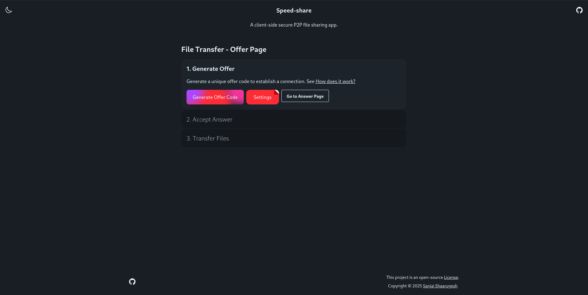
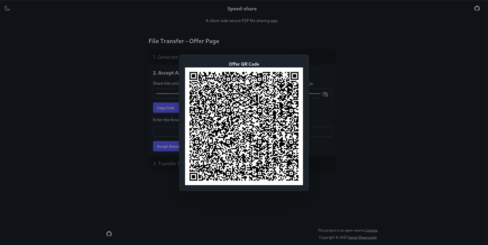

  
  

# Google Summer of Code 2025: OneBusAway Wayfinder

## 1) Project Information

**Project Title:** Wayfinder Improvements: Accessibility, Testing, and UI Enhancements

**Project Summary:**
This project aims to transform the OneBusAway Wayfinder application, a SvelteKit-based web application for transit information and navigation. With a three-pronged approach, I will: (1) conduct a comprehensive accessibility audit using both automated and manual testing to implement WCAG 2.1 AA compliance, (2) develop a robust testing infrastructure with unit, integration, and E2E tests to ensure code quality and prevent regressions, and (3) implement critical UI/UX refinements based on user feedback and modern design principles. These improvements will make Wayfinder more usable for all transit users, particularly those with disabilities, while strengthening the codebase for future development. By project completion, Wayfinder will be significantly more accessible, maintainable, and user-friendly.

## 2) Contributor Information

- **Name:** Shaarugesh Sudhakar
- **Email:** shaarugesh6@gmail.com
- **GitHub:** [github.com/Sanjai-Shaarugesh](https://github.com/Sanjai-Shaarugesh)
- **LinkedIn:** [linkedin.com/in/shaarugesh-sudhakar-462876290](https://www.linkedin.com/in/shaarugesh-sudhakar-462876290)
- **Twitter:** [x.com/shaarugesh28091](https://x.com/shaarugesh28091)
- **Portfolio:** [shaaru-portfolio.vercel.app](https://shaaru-portfolio.vercel.app/)

**Birthplace & Location**
- **Location:** Tamil Nadu, India
- **TimeZone:** UTC+05:30 (Indian Standard Time)

**Education**
- **University:** KCG College of Technology, Chennai
- **Degree:** B.Tech
- **Field of study:** Computer Science and Engineering
- **Current year:** 2nd year (Expected graduation: 2027)

## 3) Potential Mentor(s)

Primary Mentor: Sean Barbeau (OneBusAway Project Lead)
Secondary Mentor: Aaron Brethorst (OneBusAway Co-Founder)

## 4) Personal Background

### Work Experience & Open Source Contributions

#### Significant Open Source Projects

**1. Advanced-Weather-Companion for GNOME Shell**
- Developed a comprehensive GNOME Shell extension that provides daily, hourly, and weekly weather forecasts
- Implemented responsive UI with dynamic updates based on location services
- Technologies: JavaScript, GNOME Shell API, OpenWeatherMap API
- Repository: [https://github.com/Sanjai-Shaarugesh/Advanced-Weather-Companion](https://github.com/Sanjai-Shaarugesh/Advanced-Weather-Companion)

**2. githooo (OpenSource Dev Explorer)**
- Created a SvelteKit web application that aggregates and displays profiles of open source developers from GitHub
- Implemented features like filtering, sorting, and detailed profile views
- Technologies: SvelteKit, TypeScript, GitHub API, TailwindCSS
- Live demo: [githooo.vercel.app](https://githooo.vercel.app)

**3. Speed Share (Files sharing app using webrtc)**

- Create a Astro(svelte) web application that allows users to share files with others using WebRTC
- Implemented real-time file transfer using WebRTC
- Technologies: SvelteKit, TypeScript, WebRTC, TailwindCSS
- Live demo: [speeddshare.vercel.app](https://speeddshare.vercel.app)

#### Noteworthy Contributions

**OneBusAway Wayfinder**
- [PR #239](https://github.com/OneBusAway/wayfinder/pull/239): Enhanced Stop Details with Interactive Map Background
  - Improved user experience by adding an interactive map background to stop detail pages
  - Implemented responsive design considerations for various device sizes
  - Added accessibility features for keyboard navigation and screen readers

**NiiVue Medical Imaging**
- [PR #1260](https://github.com/niivue/niivue/pull/1260): UI improvements with new features
  - Implemented new visualization controls for medical imaging data
  - Enhanced user interface with improved contrast and accessibility
  - Added keyboard shortcuts for common operations

**Anki Flashcards**
- [PR #3899](https://github.com/ankitects/anki/pull/3899): Fixed timestamp handling in AnkiDroid backend
  - Identified and resolved a critical bug in timestamp handling
  - Enhanced data integrity across device synchronization
  - Improved test coverage for the affected functionality

**Electron Forge**
- [PR #227](https://github.com/electron-forge/electron-forge-docs/pull/227): Documentation fix for issue #223
  - Clarified setup instructions for new developers
  - Added examples for common configuration scenarios
  - Improved navigation structure in documentation

### Technical Skills

**Programming Languages:**
- **Expert:** JavaScript, TypeScript, HTML, CSS
- **Proficient:** Python, Rust, C, C++
- **Familiar:** Java, Kotlin, Go

**Frameworks & Libraries:**
- **Frontend:** Svelte/SvelteKit, React, Vue.js, Next.js, Nuxt.js
- **CSS:** TailwindCSS, SCSS, Bootstrap
- **State Management:** Redux, Zustand, Pinia

**Testing:**
- **Frameworks:** Jest, Vitest, Playwright, Cypress
- **Methodologies:** TDD, BDD, E2E, Unit, Integration

**Accessibility:**
- WCAG 2.1 standards and guidelines
- Screen reader testing (NVDA, VoiceOver)
- Keyboard navigation and focus management
- Color contrast and semantic HTML implementation

**Developer Tools:**
- Git, GitHub Actions, Docker, VS Code
- Webpack, Vite, Rollup
- npm, yarn, pnpm

## 5) Project Goals

1. **Accessibility Improvements:**
   - Conduct comprehensive accessibility audit against WCAG 2.1 AA standards
   - Implement fixes for all critical (Level A) and important (Level AA) issues
   - Ensure keyboard navigation works throughout the application
   - Optimize screen reader compatibility, especially for dynamic content
   - Improve color contrast and focus indicators

2. **Testing Enhancement:**
   - Establish testing infrastructure with Jest/Vitest for unit testing
   - Implement Playwright for E2E testing of critical user flows
   - Achieve minimum 80% test coverage for core functionality
   - Create testing documentation and guidelines for future contributors
   - Implement GitHub Actions for CI/CD pipeline integration

3. **UI/UX Refinements:**
   - Enhance responsive design for mobile and tablet users
   - Implement visual feedback improvements for transit status
   - Optimize map interface for better usability
   - Improve information hierarchy and readability
   - Create a consistent visual language across the application

## 6) Detailed Project Proposal

### a) April 1 - May 3: Preparation Phase (Pre-GSoC)
- Study Wayfinder's architecture, component structure, and data flow
- Set up comprehensive local development environment
- Make initial contributions to become familiar with the codebase
- Research transit application accessibility best practices
- Identify and document current accessibility and UX pain points

### b) May 4 - May 28: Community Bonding Period
- Establish regular communication schedule with mentors (weekly video calls)
- Create detailed project roadmap with milestones and deliverables
- Set up GitHub project board for task tracking
- Configure accessibility testing tools (Axe, WAVE, Lighthouse)
- Prepare documentation templates for tracking progress
- Begin preliminary accessibility audit to identify scope

### c) May 29 - July 3: Coding Phase 1 - Accessibility Focus

**Week 1 (May 29 to June 4)**
- Complete automated accessibility testing of all main application routes
- Document accessibility issues in GitHub issues with detailed descriptions
- Categorize issues by severity, complexity, and WCAG conformance level
- Prioritize fixes with mentor input
- Begin implementation of simple, high-impact fixes

**Week 2 (June 5 to June 11)**
- Perform manual keyboard navigation testing
- Test with screen readers (NVDA, VoiceOver)
- Focus on transit information accessibility:
  - Stop listings
  - Route information
  - Departure boards
- Begin implementing semantic HTML improvements

**Week 3 (June 12 to June 18)**
- Implement ARIA attributes for dynamic content
- Focus on map interface accessibility:
  - Alternative text for map features
  - Keyboard controls for map navigation
  - Screen reader announcements for location changes
- Create accessible color scheme alternatives

**Week 4 (June 19 to June 25)**
- Improve form accessibility:
  - Label associations
  - Error handling
  - Focus management
- Enhance transit alert notifications for screen readers
- Implement skip navigation links

**Week 5 (June 26 to July 3)**
- Create documentation for accessibility features
- Refine and polish implemented accessibility improvements
- Begin setting up testing framework for accessibility features
- Prepare midterm evaluation materials

### d) July 4 - July 12: Midterm Evaluations
- Review Phase 1 accomplishments with mentors
- Demonstrate accessibility improvements
- Refactor code based on mentor feedback
- Finalize test strategy for Phase 2
- Create detailed plan for UI/UX improvements

### e) July 13 - Aug 24: Coding Phase 2 - Testing & UI Enhancement

**Week 6-7 (July 13 - July 26)**
- Set up testing infrastructure:
  - Configure Jest/Vitest for unit tests
  - Set up Svelte Testing Library for component tests
  - Implement Playwright for E2E testing
- Create test utilities and helpers
- Begin writing unit tests for core data processing functions:
  - Transit data parsers
  - Geolocation utilities
  - Time and schedule calculators

**Week 8-9 (July 27 - August 9)**
- Implement component tests for UI elements:
  - Stop displays
  - Route listings
  - Trip planners
  - Settings interfaces
- Create E2E tests for critical user flows:
  - Finding nearby stops
  - Planning a trip
  - Viewing real-time arrivals
  - Setting favorites
- Implement GitHub Actions CI workflow

**Week 10-11 (August 10 - August 17)**
- Focus on UI/UX improvements:
  - Enhance responsive design for mobile
  - Optimize map UI for different viewport sizes
  - Improve visual hierarchy of transit information
  - Implement loading states and error handling improvements
  - Create consistent typography system

**Week 12 (August 18 - August 24)**
- Final polishing of all features
- Complete documentation:
  - Accessibility implementation details
  - Testing strategy and coverage
  - UI/UX improvements
- Fix any remaining bugs
- Prepare final deliverables

### f) Aug 25 - Aug 29: Final Phase
- Submit final code and documentation
- Create comprehensive README updates
- Write detailed blog post about the project experience
- Record demo video showcasing improvements
- Plan for post-GSoC contributions

## Project Timeline Summary

| Time Period | GSOC 2025 Phase | Key Deliverables |
|-------------|-----------------|------------------|
| April 1 - May 3 | Preparation | - Initial contributions - Local development setup - Preliminary research |
| May 4 - May 28 | Community Bonding | - Project roadmap - Communication channels - Testing environment setup |
| May 29 - July 3 | Coding Phase 1 | - Comprehensive accessibility audit - WCAG conformance improvements - Screen reader compatibility - Keyboard navigation enhancements |
| July 4 - July 12 | Midterm Evaluation | - Progress documentation - Demonstration of accessibility features - Phase 2 detailed plan |
| July 13 - Aug 24 | Coding Phase 2 | - Testing infrastructure - Unit/component/E2E tests - UI/UX improvements - Responsive design optimization |
| Aug 25 - Aug 29 | Final Evaluation | - Complete codebase - Documentation - Blog post and video demo |

## 7) Planned GSoC Work Hours

**Commitments & Availability**
- I commit to dedicate 30+ hours per week (210+ hours total) to this project with no planned personal vacations or travel.
- My working hours are as follows:
  - Weekdays: 6-8 Hours - UTC+05:30 (IST)
    - 9:00 AM - 12:00 PM
    - 2:00 PM - 5:00 PM
  - Weekends: 4-6 Hours - UTC+05:30 (IST)
    - 10:00 AM - 1:00 PM
    - 3:00 PM - 6:00 PM (as needed)
- I can adapt my schedule to accommodate mentor availability for meetings in different time zones.
- My academic semester ends in early May, allowing full-time dedication to GSoC during summer.

## 8) Skill Set

**Why I'm Qualified:**
- Experience with SvelteKit and modern front-end frameworks
- Strong understanding of web accessibility principles and WCAG guidelines
- Practical experience implementing screen reader compatibility
- Testing expertise across unit, integration, and E2E methodologies
- Demonstrated contributions to open source projects
- Background in UI/UX design principles and implementation

**Relevant Courses/Certifications:**
- Web Accessibility Fundamentals (Udacity)
- Modern JavaScript: ES6+ Features (Pluralsight)
- Advanced TypeScript Programming (Frontend Masters)
- Test-Driven Development with JavaScript (Udemy)
- Responsive Web Design (freeCodeCamp)

## 9) More About Me

I'm deeply passionate about improving the accessibility of public transit information systems because I believe that technology should empower everyone, regardless of ability. Growing up in Tamil Nadu, I've experienced firsthand how difficult public transportation can be to navigate, especially for people with disabilities. This motivates me to contribute to projects like OneBusAway that democratize access to essential services.

What excites me most about this project is the opportunity to make a tangible impact on real users' lives. By improving Wayfinder's accessibility, testing, and user experience, we can help people navigate their cities more easily and confidently. My background in web development, coupled with my experience in accessibility testing and UI design, makes this project a perfect fit for my skills and interests.

Beyond technical skills, I bring a user-centered perspective and a meticulous attention to detail. I'm committed to creating software that's not just functional but also intuitive and accessible to everyone. The OneBusAway project's mission of improving public transit through open data and open source software deeply resonates with me, and I would be honored to contribute to this important work.

I look forward to the opportunity to collaborate with the OneBusAway community and contribute to making Wayfinder even better for all users.

## 10) References & Resources

- [OneBusAway Project Documentation](https://github.com/OneBusAway/onebusaway)
- [Wayfinder GitHub Repository](https://github.com/OneBusAway/wayfinder)
- [WCAG 2.1 Guidelines](https://www.w3.org/TR/WCAG21/)
- [SvelteKit Documentation](https://kit.svelte.dev/docs)
- [Transit App Accessibility Best Practices](https://www.transit.dot.gov/ADA)